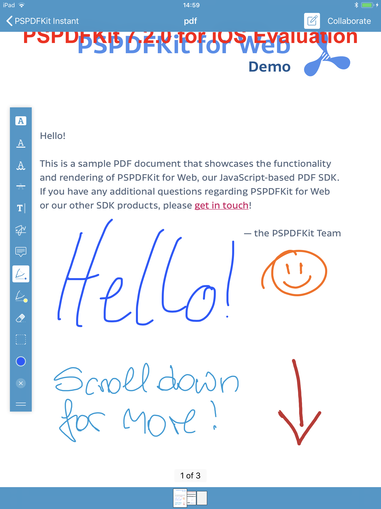
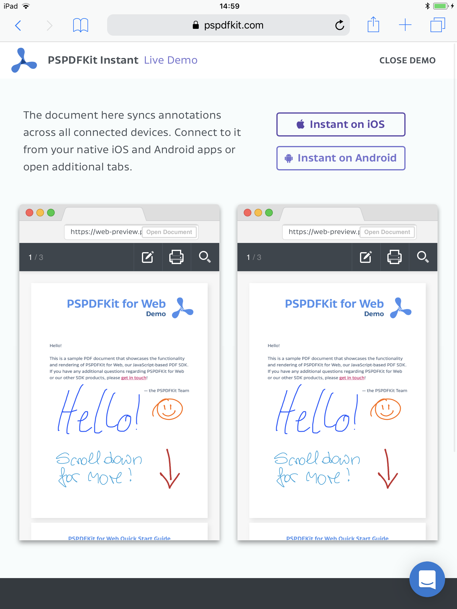
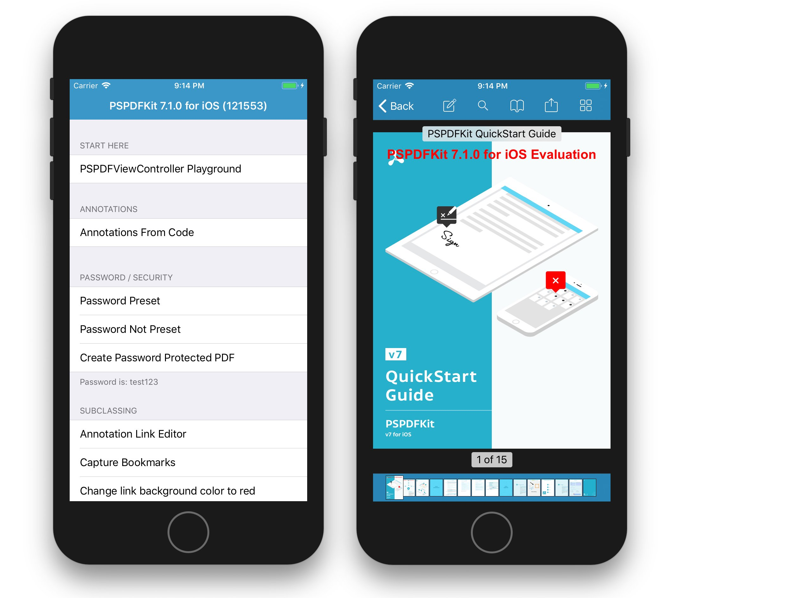
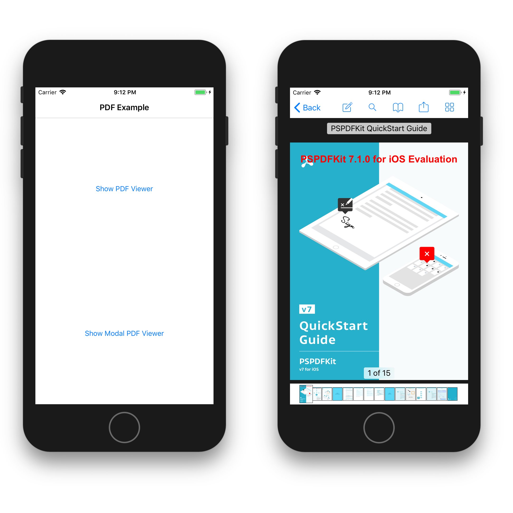
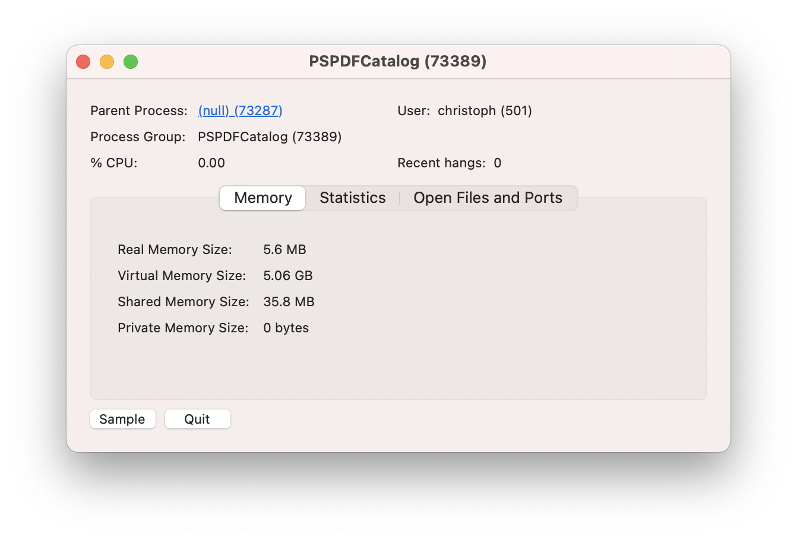

Xamarin PSPDFKit for iOS and Mac Bindings
=========================================

- Xamarin.iOS Bindings for PSPDFKit 12.0.3 for iOS
- Xamarin.Mac Bindings for PSPDFKit 5.1.0 for macOS

#### PSPDFKit

The [PSPDFKit SDK](https://pspdfkit.com/) is a framework that allows you to view, annotate, sign, and fill PDF forms on iOS, Android, Windows, macOS, and Web.

[PSPDFKit Instant](https://pspdfkit.com/instant) adds real-time collaboration features to seamlessly share, edit, and annotate PDF documents.

#### Related

- Xamarin.Android Bindings for PSPDFKit for Android: [PSPDFKit/Xamarin-Android](https://github.com/PSPDFKit/Xamarin-Android)
- Xamarin Bindings for PSPDFKit for Windows UWP: [PSPDFKit/Xamarin-UWP](https://github.com/PSPDFKit/Xamarin-UWP)

## Support, Issues and License Questions

PSPDFKit offers support for customers with an active SDK license via https://pspdfkit.com/support/request/

Are you evaluating our SDK? That's great, we're happy to help out!
To make sure this is fast, please use a work email and have someone from your company fill out our sales form: https://pspdfkit.com/sales/

Minimum Requirements
====================

In order to build this binding project you need:

- **Visual Studio for Mac**
- **Xamarin.iOS 13.6 +**
- **Xamarin.Mac 6.6 +**

Build Instructions
==================

## Step 1 - Get the bindings

1. Clone this repository to your computer.
2. Open the `Xamarin-iOS` directory.

## Step 2 - Integrating PSPDFKit

There's 2 ways for integrating PSPDFKit into your project. We highly recommend using our nuget packages from nuget.org in Visual Studio as it requires less work for the customer and also eliminates the possibility of build errors, which can happen from time to time.

### Integrating PSPDFKit via Nuget (Recommended)

1. Right-Click on your project in Visual Studio and select "Manage Nuget Packages…"
2. In the `Browse` section for "nuget.org" search for "PSPDFKit"


3. Select the 3 iOS packages, `PSPDFKit.iOS.Model`, `PSPDFKit.iOS.UI`*, and `PSPDFKit.iOS.Instant`*
4. Tap on "Add Packages" to add the nuget packages to your project.

`*` Items with an asterisk are *optional*, you only need to add those if you also want to use the components.

Now you are done and can skip to [step 3](https://github.com/PSPDFKit/Xamarin-iOS#step-3---using-pspdfkit-in-your-project)!

### Integrating PSPDFKit by adding the DLLs (Advanced) 
#### Downloading required files

In order to use this C# binding because Xamarin does not support `xcframework` yet, you can only build the binding project on macOS, you will need to obtain the full PSPDFKit framework files by doing either `./build.sh` and let the build script download the frameworks and build the bindings or by `./build.sh --target DownloadDeps` which will only download the required frameworks.

### Get your dlls

### Using command line / terminal

We are using [Cake](https://cakebuild.net) as our build system, this allows us to build on both Windows and macOS from a single script.

1. Run `./build.sh` (macOS) command from the root directory in terminal.
2. All the resulting dlls will be inside the root folder.
3. Go to **Step 3 - Using PSPDFKit in your project**.

### Using Visual Studio for Mac 

1. Run `./build.sh --target DownloadDeps` (macOS) command from the root directory in terminal.
2. Open `PSPDFKit.sln` located in the root folder.
2. Build the binding projects inside the `iOS` or `Mac` solution folders.
3. Get the dlls from the `bin` folder of each project.
4. Go to **Step 3 - Using PSPDFKit in your project**.

#### Advanced build

We use the `Default` build task which builds all binding projects as long as the frameworks are present inside each directory (see **Copy required files**), if an optional framework is not present this Task will just skip.

In the case you just want the Mac bits to be built you can do `./build.sh --target mac`. Here are the most common tasks available in the build script, they are particularly useful when you are integrating this into a CI Server.

|              | General Tasks                 |
|:------------:|-------------------------------|
|     **Task** | **Description**               |
|      Default | Builds all PSPDFKit dlls.     |
|          ios | Builds iOS PSPDFKit dlls.     |
|          mac | Builds macOS PSPDFKit dlls.   |
|        Clean | Cleans the build.             |
| DownloadDeps | Downloads build dependencies. |

To list all available tasks you can do `./build.sh --showdescription`.

## Step 3 - Using PSPDFKit in your project

If you don't use nuget, add the generated PSPDFKit dlls as a reference to into your own Xamarin project and add the corresponding using statements depending on the dlls referenced into your project.

```csharp
using PSPDFKit.Model;
using PSPDFKit.UI;
using PSPDFKit.Instant;
```

Also you do need to set your **license key** early on in your `AppDelegate`, before accessing any other PSPDFKit classes. You can get your license key from your [customer portal](https://customers.pspdfkit.com/) if you haven't done so already. Pass `null` to use the trial version.

```csharp
public override bool FinishedLaunching (UIApplication application, NSDictionary launchOptions)
{
	PSPDFKitGlobal.SetLicenseKey (null, null);
	// ...
}
```

# PSPDFKit Instant

Support for Instant was added with the Xamarin.iOS Bindings for PSPDFKit 7.2.0 for iOS.

With PSPDFKit Instant, it’s easier than ever to add real-time collaboration features to your PSPDFKit-powered app, allowing your users to seamlessly share, edit, and annotate PDF documents across iOS, Android, and web. With just a few lines of code, PSPDFKit Instant gives your users a massive productivity boost.

For more information about Instant, please have a look at our [website](https://pspdfkit.com/instant/).

# Examples

You can find several sample projects in the `Examples` folder, including a catalog, Xamarin.Forms, and macOS example.

## How to Run the Example Projects

1. Complete **[Step 2 (Advaned)](https://github.com/PSPDFKit/Xamarin-iOS#integrating-pspdfkit-by-adding-the-dlls-advanced)**.
2. Open the `PSPDFKit.sln` solution in Visual Studio.
3. Select the example project and device you want to run it on (alternatively you can also right-click on the project and select "Build `Project Name`").

4. Tap on the triangle on the left to run the project.

### PSPDFKit Instant Example

This example is included in the PSPDFCatalog example, but you can also find the code [here][Instant Example].

The PSPDFKit Instant example shows how easy and efficient Instant works. Just go the [Instant demo page](https://pspdfkit.com/instant/demo/) and tap on `Instant on iOS`, this will show a code at step three, which you have to enter in the example on your device. Afterwards you'll be connected to the server and you can start testing!

<div id="image-table">
     <table>
  	    <tr>
      	    <td>
             
           </td>
           <td>
             
           </td>
       </tr>
    </table>
</div>

### PSPDFKit Catalog

The `PSPDFKit Catalog` project includes various examples for pretty much every use-case and will help you to build your own app with PSPDFKit.



### Xamarin.Forms

The `XFSample.iOS` project is an example showcasing how to build an app with PSPDFKit using Xamarin.Forms.


### MacPDFViewer

`MacPDFViewer` is an easy example on how build a PDF viewer on Mac.


# Troubleshooting

## Swift Runtime Support

Apple started shipping the Swift Runtime with iOS 12.2. To deploy apps using Swift (which includes PSPDFKit) on iOS 12.1 and 12.0, the Swift Runtime needs to be added manually via adding the `Xamarin.iOS.SwiftRuntimeSupport` NuGet dependency: https://www.nuget.org/packages/Xamarin.iOS.SwiftRuntimeSupport

However, only doing this will then get your app rejected by the App Store due to the following error:

```
ITMS-90426: Invalid Swift Support - The SwiftSupport folder is missing. Rebuild your app using the current public (GM) version of Xcode and resubmit it.
```

This is due to the fact that Xamarin does not officially support wrapping Swift libraries, so when creating the archives Visual Studio will not create the necesseray `SwiftSupport` folder there. To fix this there is a workaround available.

Since Xcode properly supports wrapping Swift libraries, we can just submit it from here and let Xcode do the work of creating the archives properly.

1. In Visual Studio Form Mac -> Build -> Archive for publishing
2. The archive window will show up in Visual Studio for Mac
3. Open Xcode and in there open the Organizer
4. The Xamarin App archive will show up there
5. Continue the upload steps in Xcode

This is only an issue if you must support iOS < 12.2.

## Generating a Stack Trace

If you experience a crash on your end it's very valuable for us to have as much information as possible to provide you with the best support experience.
Such valuable information includes a stack trace of the crash. Here's a quick step-by-step guide, showing how to generate a stack trace in Visual Studio 2019:

#### Device (Recommended)

1. In the Terminal app enter the following command: `touch ~/.mtouch-launch-with-lldb`. This will essentially let you use lldb to debug your application when it launches.
2. Launch your app in debug mode in Visual Studio for Mac.
3. Open the Application Output window in Visual Studio. It will ask you to execute another command in the Terminal.
4. Once lldb is set up in the terminal window, you can simply use it like you would in Xcode.
5. To get a stack trace you need to type `bt all`.

If you want to remove lldb from your debug setup again you can simply run `rm ~/.mtouch-launch-with-lldb` in your Terminal.


#### Simulator

1. Launch your app in debug mode in Visual Studio for Mac.
2. Open your Activity Monitor app.
3. In the Activity Monitor app search for your app name in the search bar. To give an example, if I want to attach to our PSPDFCatalog example app I need to search for "PSPDFCatalog".
4. Double-Click on the process to view the information window.
5. Now you need to identify the PID (Process ID) of your process. The PID is the number included in the round brackets in the window title, e.g. if the title says "PSPDFCatalog (73389)", then 73389 is your PID. Here's an example of how that looks: 


6. Now you need to open your Terminal app and enter the following command to attach lldb: `lldb -p YOUR-PID aux`. For the example case above this is what the full command would look like: `lldb -p 73389 aux`.
7. Once lldb is set up in the terminal window, you can simply use it like you would in Xcode.
8. To get a stack trace you need to type `bt all`.

# Contributing

Please ensure [you signed our CLA](https://pspdfkit.com/guides/web/current/miscellaneous/contributing/) so we can accept your contributions.


[Instant Example]: https://github.com/PSPDFKit/Xamarin-iOS/tree/master/Examples/PSPDFCatalog/PSPDFCatalog/Catalog/Instant
