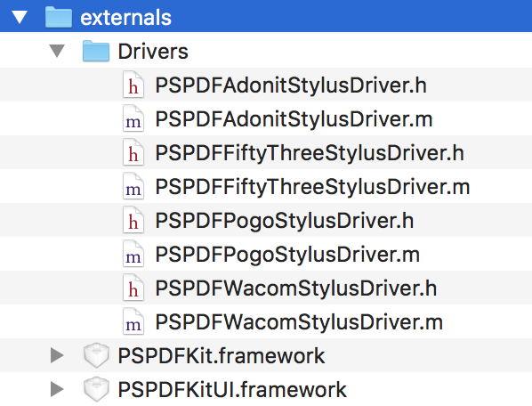
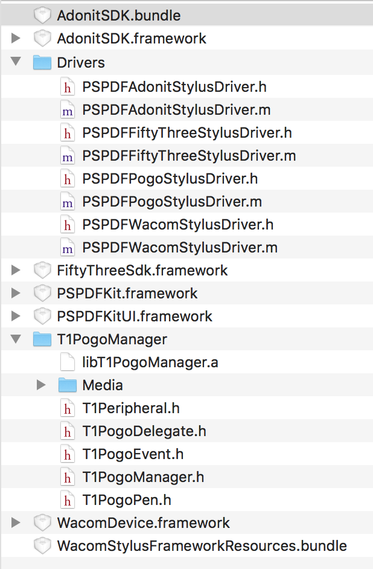
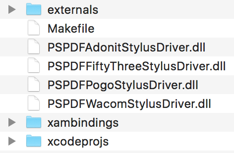

Xamarin - Stylus Support
========================

After successfully building [PSPDFKit.iOS.dll and PSPDFKit.iOS.UI.dll](https://github.com/PSPDFKit/Xamarin-iOS/blob/master/README.md) you can add stylus support to the framework by following these steps:

## Step 1 - Copy required files

1. Copy `PSPDFKit.framework` and `PSPDFKitUI.framework` into [StylusDrivers/externals](externals/).
2. Copy `Extras/StylusSupport/Drivers` (you can find this folder in the dmg you downloaded from your customer portal) into [StylusDrivers/externals](externals/).



## Step 2 - Add stylus SDKs

1. Visit our [stylus support documentation](https://pspdfkit.com/guides/ios/current/features/stylus-support/) for a list of supported styluses and download links for the vendor SDKs.
2. After downloading the vendor SDKs (`.framework` and/or `.bundle` files) you integrate them by moving them into the [StylusDrivers/externals](externals/).



## Step 3 - Building the stylus drivers

1. Switch to the `Xamarin-iOS/StylusDrivers` folder in a terminal.
2. You can see all available build options by running `$ make`.
3. To build all drivers call `$ make alldrivers`. To build individual drivers call `$ make adonit` for example.
4. The compiled driver Dlls will be placed in the `Xamarin-iOS/StylusDrivers` folder.



## Step 4 - Integrating the stylus drivers

Start by adding the compiled driver Dlls into your own Xamarin.iOS project and add the following using statement:

```csharp
using PSPDFKit.UI.StylusSupport;
```

Before creating a `PSPDFViewController`, register the driver classes by setting `PSPDFKitGlobal.SharedInstance.GetStylusManager ().AvailableDriverClasses`.

```csharp
PSPDFKitGlobal.SharedInstance.GetStylusManager ().AvailableDriverClasses = new NSOrderedSet (
	(INativeObject) new Class (typeof (PSPDFAdonitStylusDriver))
);
```
If you use `PSPDFAnnotationToolbar`, show the stylus button by setting `ShowingStylusButton` to `true`.

To see this in action, take a look at our [example code](https://github.com/PSPDFKit/Xamarin-iOS/blob/4172fc4e64eba192249db521830aa761eb4e41b1/Examples/PSPDFCatalog/PSPDFCatalog/DVCMenu.cs#L132-L153).

